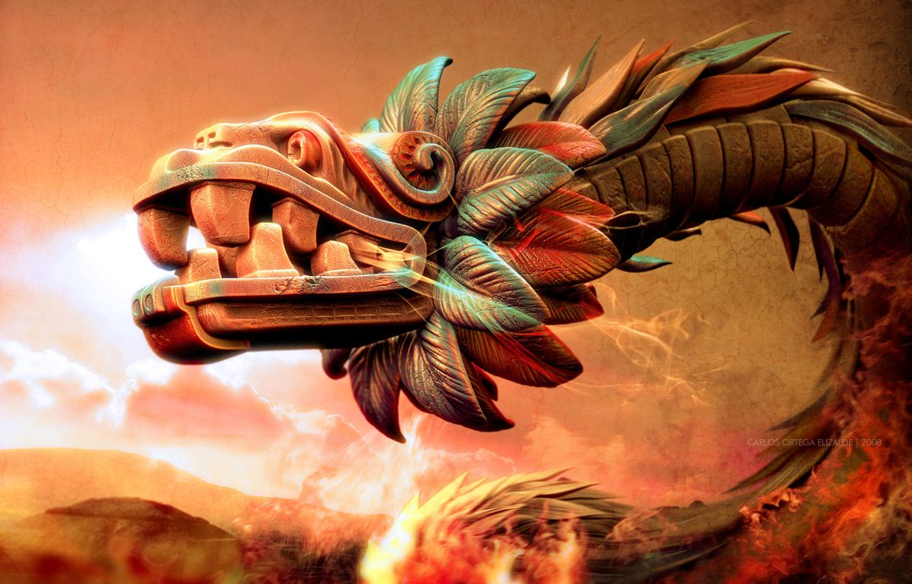

# Quetzalcoatl (fancy name for yet another Snake Game)

This repository contains our code for a simple snake game created with C++ and Qt5 in ≈12h.
You can find some demo videos in the folder [images](images)